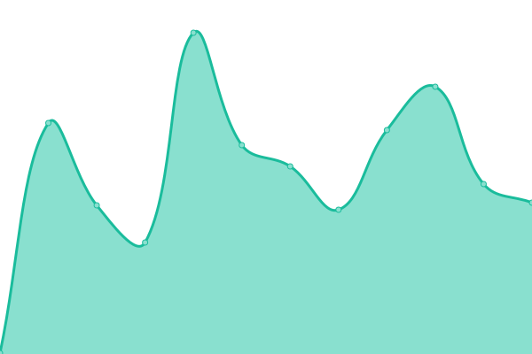

# [📈 Live Status](https://status.retriox.net): <!--live status--> **🟩 All systems operational**

This repository contains the open-source uptime monitor and status page for [Upptime](https://upptime.js.org), powered by [Upptime](https://github.com/upptime/upptime).

With [Upptime](https://upptime.js.org), you can get your own unlimited and free uptime monitor and status page, powered entirely by a GitHub repository. We use [Issues](https://github.com/upptime/upptime/issues) as incident reports, [Actions](https://github.com/brockbreacher/statuspage/actions) as uptime monitors, and [Pages](https://status.retriox.net) for the status page.

<!--start: status pages-->
<!-- This summary is generated by Upptime (https://github.com/upptime/upptime) -->
<!-- Do not edit this manually, your changes will be overwritten -->
<!-- prettier-ignore -->
| URL | Status | History | Response Time | Uptime |
| --- | ------ | ------- | ------------- | ------ |
|  [Retriox](https://retriox.net) | 🟩 Up | [retriox.yml](https://github.com/brockbreacher/statuspage/commits/HEAD/history/retriox.yml) | 

 830ms
     
 | 

<a href="https://status.retriox.net/history/retriox">100.00%</a>
    

|  Webpanel | 🟩 Up | [webpanel.yml](https://github.com/brockbreacher/statuspage/commits/HEAD/history/webpanel.yml) | 

 531ms
     
 | 

<a href="https://status.retriox.net/history/webpanel">100.00%</a>
    

|  [Kandor](https://status.lutis.net/status/cardboard) | 🟩 Up | [kandor.yml](https://github.com/brockbreacher/statuspage/commits/HEAD/history/kandor.yml) | 

 335ms
     
 | 

<a href="https://status.retriox.net/history/kandor">63.04%</a>
    

|  [Cardboards.net](https://cardboards.net) | 🟩 Up | [cardboards-net.yml](https://github.com/brockbreacher/statuspage/commits/HEAD/history/cardboards-net.yml) | 

 1140ms
     
 | 

<a href="https://status.retriox.net/history/cardboards-net">100.00%</a>
    

<!--end: status pages-->

[**Visit our status website →**](https://status.retriox.net)

## 📄 License

- Powered by: [Upptime](https://github.com/upptime/upptime)
- Code: [MIT](./LICENSE) © [Upptime](https://upptime.js.org)
- Data in the `./history` directory: [Open Database License](https://opendatacommons.org/licenses/odbl/1-0/)
